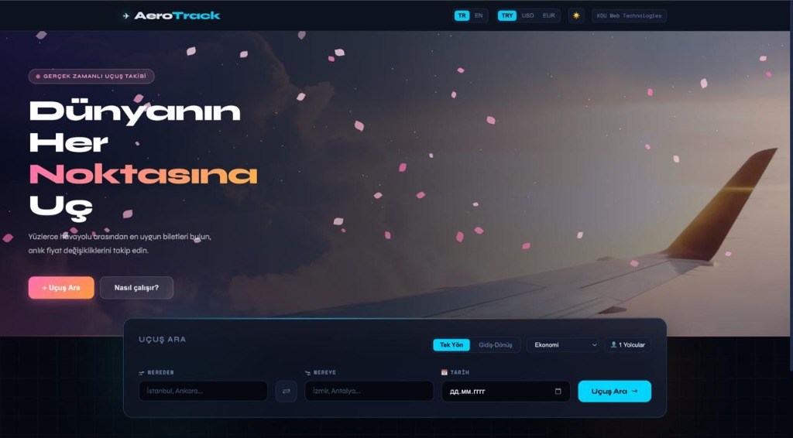
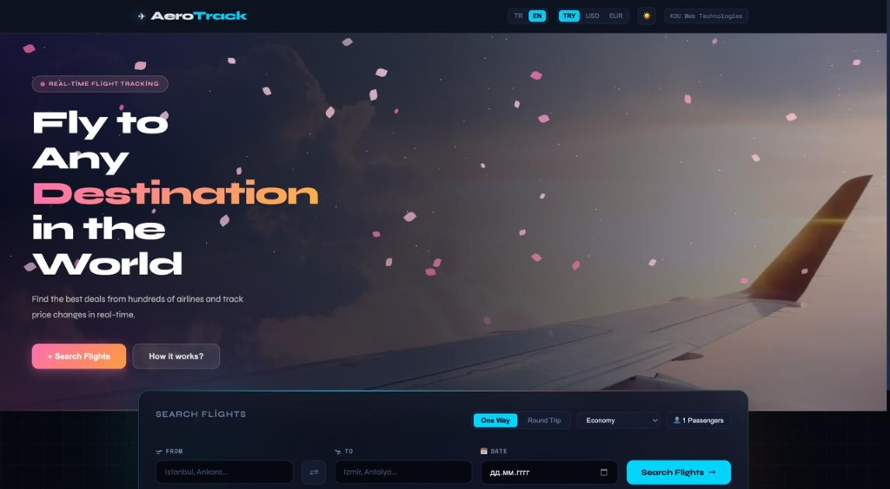

# ✈ AeroTrack — Dinamik Uçuş Arama ve Takip Platformu

> Kocaeli Üniversitesi, Yazılım Mühendisliği — Web Teknolojileri Dersi Projesi

AeroTrack; gerçek zamanlı uçuş verilerini kullanarak uçuş arama, gelişmiş filtreleme, anlık fiyat değişimi takibi (Toast uyarıları), koltuk seçimi, mock ödeme ve dijital biniş kartı (Boarding Pass) üretimi sunan premium tasarımlı bir web uygulamasıdır.

## 🖼️ Ekran Görüntüleri (Screenshots)

### 1. Türkçe — Koyu Tema (Turkish — Dark Mode)


### 2. English — Dark Mode


### 3. English — Light Mode


---

## 🚀 Öne Çıkan Özellikler

### 1. Dinamik Uçuş Arama & Otomatik Havalimanı Tamamlama (Autocomplete)
* Kalkış veya varış yeri yazılırken canlı havalimanı ve şehir kodlarını (`/api/airports`) listeleyen otomatik tamamlama.
* Tek Yön / Gidiş-Dönüş uçuş seçimi ve yolcu sayıları (Yetişkin, Çocuk, Bebek) ile kabin sınıfı filtreleri.

### 2. Gelişmiş Sıralama & Filtreleme (FilterBar)
* En Ucuz, En Hızlı (Kısa Süreli) ve En İyi (Fiyat/Süre oranı) uçuşları sıralama.
* Aktarma sayısı (Direkt, 1 Aktarma, 2+ Aktarma), Fiyat Aralığı Slider'ı ve havayollarına göre anlık süzme.

### 3. Fiyat Analiz Göstergesi & Alarm Simülasyonu
* Uçuş kartlarında fiyatın ortalamaya göre durumunu (Ucuz, Ortalama, Pahalı) belirten renkli gösterge.
* Takibe alınan uçuşların fiyatlarındaki değişimleri anlık izleyen ve fiyat düştüğünde/yükseldiğinde ekranda beliren Toast bildirimleri.

### 4. Koltuk Seçimi & Bilet Satın Alma (Checkout)
* Doğrudan uçuş kartı üzerinden koltuk seçimi şeması (A1, B2 gibi seçilebilir ve dolu koltuklar).
* Ad, Soyad, TC Kimlik No doğrulaması ve Luhn Algoritmalı kredi kartı mock ödeme adımları.

### 5. Biletlerim Paneli (QR Kodlu Boarding Pass)
* Satın alınan biletlerin (Koltuk no, biniş grubu, kapı no) listelendiği şık bir dijital biniş kartı görünümü.
* Her bilet için otomatik üretilen canlı QR kod simülasyonu ve bilet iptal olanağı.

### 6. Çoklu Dil, Kur ve Tema Seçenekleri (i18n, Currency & Dark Mode)
* Navbar'dan TR/EN dilleri, TRY/USD/EUR para birimleri ve Güneş/Ay butonu ile aydınlık/karanlık temalar arasında anlık geçiş.
* Tüm arayüz ögeleri, fiyat hesaplamaları, hata mesajları ve limitler seçilen dile/kura göre dinamik biçimlenir.

---

## Ekip & İş Bölümü

| Öğrenci | Rol | Dosyalar |
|---------|-----|---------|
| Öğrenci 1 | React UI Components & CSS | `components/*/`, `*.module.css` |
| Öğrenci 2 | API Fetch & Node.js Proxy | `server/`, `services/`, `hooks/useFlights.js` |
| Öğrenci 3 | State Management, Validations & Integration | `context/`, `utils/validators.js`, `App.jsx` |

---

## Kurulum

### 1. Ön Gereksinimler
- Node.js 18+
- npm veya yarn

### 2. Frontend Kurulumu
```bash
# Proje klasöründe
npm install
npm run dev
# → http://localhost:5173
```

### 3. Backend Proxy Kurulumu (Öğrenci 2)
```bash
cd server
npm install
cp ../.env.example ../.env
# .env dosyasına RAPIDAPI_KEY ekleyin
npm run dev
# → http://localhost:3001
```

### 4. Mock Veri ile Test (API key'siz)
`src/hooks/useFlights.js` dosyasında:
```js
const USE_MOCK = true  // API key olmadan çalışır
```

---

## Kullanılan Teknolojiler & React Kapsamı

| Kavram | Kullanıldığı Yer |
|--------|-----------------|
| `useState` | Context'ler, Arama Barı, Satın Alma Akışı |
| `useEffect` | Otomatik tamamlama gecikmeleri, zamanlayıcı simülasyonları, localStorage senkronizasyonu |
| `useRef` | Dış tıklama kontrolleri ve zamanlayıcı referansları |
| `useMemo` / `useCallback` | Filtreleme/Sıralama mantıkları ve dil çeviri fonksiyonları |
| `createContext` / `useContext` | AppContext, LanguageContext, CurrencyContext, ThemeContext |
| `Props` / `.map()` | FlightCard rendering, Booking List rendering |
| CSS Modules | Temaya duyarlı modüler stil dosyaları |
